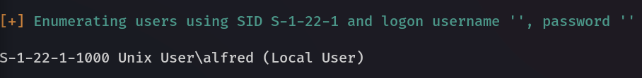

# Active Information Gathering

<mark style="color:red;">**DNS Enumeration**</mark>\
To Perform a DNS enumeration on the MX records of megacorpone.com

```
host -t mx megacorpone.com 
```

<mark style="color:yellow;">DNS recon</mark>

```
dnsrecon -d megacorpone.com -t std
```

To bruteforce subdomain

```
dnsrecon -d megacorpone.com -D ~/list.txt -t brt
```

```
dnsenum megacorpone.com
```

**Nslookup**

```
nslookup mail.megacorptwo.com
```


<mark style="color:red;">**Port Scanning with Nmap**</mark>

target IP : 192.168.209.52\
Configuring our iptables rules for the scan

```
sudo iptables -I INPUT 1 -s 192.168.209.52 -j ACCEPT
sudo iptables -I OUTPUT 1 -d 192.168.209.52 -j ACCEPT
sudo iptables -Z
```

* (Inbound) and **OUTPUT** (Outbound) chains, followed by the rule number.&#x20;
* **-s** to specify a source IP address
* **-d** to specify a destination IP address
* **-j** to **ACCEPT** the traffic.
* **-Z** option to zero the packet and byte counters in all chains.(use it after scan to&#x20;

To review **iptables** statistics to get a clearer idea of how much traffic our scan generated.&#x20;

```
sudo iptables -vn -L
```

**-v** option to add some verbosity to our output\
**-n** to enable numeric output\
**-L** to list the rules present in all chains.

Nmap **SYN or stealth scanning**


```bash
sudo nmap -sS 192.168.50.149
```


**TCP Connect Scanning**

```
nmap -sT 192.168.50.149
```

**UDP Scanning**

```
sudo nmap -sU 192.168.50.149
```

**Network Sweeping**

```
nmap -sn 192.168.50.1-253
nmap -v -sn 192.168.50.1-253 -oG ping-sweep.txt
grep Up ping-sweep.txt | cut -d " " -f 2
```

**-oG** Nmap's "greppable" output parameter

To perform a <mark style="color:yellow;">**top twenty port scan**</mark>

```
nmap -sT -A --top-ports=20 192.168.50.1-253 -oG top-port-sweep.txt
```

`cat /usr/share/nmap/nmap-services`

```
sudo nmap -O 192.168.50.14 --osscan-guess
```

\-O to perform OS detection Scan \
\-sV to perform service-version scan

<mark style="color:yellow;">**Nmap scripts  by the Nmap Scripting Engine (NSE)**</mark>

NSE scripts are located in the `/usr/share/nmap/scripts` directory.

[_example: `nmap --script http-headers 192.168.50.6`  The http-headers script, for example, attempts to connect to the HTTP service on a target system and determine the supported headers._](#user-content-fn-1)[^1]

To view more information about a script, we can use the**`--script-help`** option

The _<mark style="color:purple;">**Test-NetConnection**</mark>_ function checks if an IP responds to ICMP and whether a specified TCP port on the target host is open.(On Windows Powershell)

```
Test-NetConnection -Port 445 192.168.50.151
```

<mark style="color:blue;">**LABS**</mark>

1. Start Walk Through Exercises in VM Group #1, use Nmap to conduct a SYN stealth scan of your target IP range, and save the output to a file. Use grep to show machines that are online. Which host has port 25 open?&#x20;

<pre><code>sudo nmap -p 25 -sS 192.168.209.0/24 -oG 3.txt
<strong>grep open 3.txt|cut -d " " -f 2            
</strong>192.168.209.8
</code></pre>

2. Perform an Nmap TCP scan against the addresses on the Walk Through Exercises on VM Group #1. Which host is running a WHOIS server?

```
sudo nmap -sV 192.168.209.0/24 -oG 22.txt
grep whois 22.txt|cut -d " " -f 2      
192.168.209.251
```

<mark style="color:red;">**SMB Enumeration**</mark>\
[https://null-byte.wonderhowto.com/how-to/enumerate-smb-with-enum4linux-smbclient-0198049/](https://null-byte.wonderhowto.com/how-to/enumerate-smb-with-enum4linux-smbclient-0198049/)

NetBIOS[3](https://portal.offsec.com/courses/pen-200/books-and-videos/modal/modules/information-gathering/active-information-gathering/smb-enumeration#fn3) service listens on **TCP port 139** ; SMB **(TCP port 445)**

Using nmap to scan for the NetBIOS service

```
nmap -v -p 139,445 -oG smb.txt 192.168.50.1-254
```

Tools for specifically identifying NetBIOS information

**nbtscan**

```
sudo nbtscan -r 192.168.50.0/24
```

NSE scripts to discover and enumerate SMB services

```
ls -1 /usr/share/nmap/scripts/smb*
```

Target IP : 192.168.209.149

```
nmap -v -p 139,445 --script smb-os-discovery 192.168.50.152
```

<mark style="color:blue;">**Labs**</mark>

1. Power on the Walk Through VM Group 1 and use Nmap to create a list of the SMB servers in the VM Group 1. How many hosts have port 445 open?

```
nmap -p 445 -oG smb.txt 192.168.209.0/24
```

```
grep open smb.txt|cut -d " " -f 2 > smbcount.txt
```

```
wc smbcount.txt 
10  10 152 smbcount.txt

```

3. Server message block (SMB) is an extremely important service that can be used to determine a wealth of information about a server, including its users. Start up _Topic Exercise VM Group 1_ and use Nmap to identify the lab machines listening on the SMB port and then use _enum4linux_ to enumerate those machines. In doing so, you will find a machine with the local user _alfred_. The flag is located in the comments on one of the SMB shares of the host that has the _alfred_ user.

```
nmap -p 139,445 -oG smb2.txt 192.168.209.0/24
```

```
enum4linux 192.168.247.13
```

<figure><figcaption><p>Found User alfred using enum4linux</p></figcaption></figure>

```
smbclient -L //192.168.247.13/
```

<figure><figcaption><p>Enumerated SMB shares of the host using smbclient</p></figcaption></figure>

**SMTP Enumeration**

nc to validate SMTP users

```
kali@kali:~$ nc -nv 192.168.50.8 25
(UNKNOWN) [192.168.50.8] 25 (smtp) open
220 mail ESMTP Postfix (Ubuntu)
VRFY root
252 2.0.0 root
VRFY idontexist
550 5.1.1 <idontexist>: Recipient address rejected: User unknown in local recipient table
^C
```

We can observe how the success and error messages differ. The SMTP server readily verifies that the user exists. This procedure can be used to help guess valid usernames in an automated fashion.

SMTP user Enumeration using Python Script

```python
#!/usr/bin/python

import socket
import sys

if len(sys.argv) != 3:
        print("Usage: vrfy.py <username> <target_ip>")
        sys.exit(0)

# Create a Socket
s = socket.socket(socket.AF_INET, socket.SOCK_STREAM)

# Connect to the Server
ip = sys.argv[2]
connect = s.connect((ip,25))

# Receive the banner
banner = s.recv(1024)

print(banner)

# VRFY a user
user = (sys.argv[1]).encode()
s.send(b'VRFY ' + user + b'\r\n')
result = s.recv(1024)

print(result)

# Close the socket
s.close()
```

We can run the script by providing the username to be tested as a first argument and the target IP as a second argument.

```
#Example usage
python3 smtp.py root 192.168.50.8
python3 smtp.py johndoe 192.168.50.8
```

<mark style="color:blue;">**LABS**</mark>

1. Power on the Walk Through Exercises VM Group 1 and search your target network range to identify any systems that respond to SMTP. Once found, open a connection to port 25 via Netcat and run _VRFY_ command against the _root_ user. What reply code does the SMTP server send as a response?

```
nmap -p 25 -oG smtp.txt 192.168.247.0/24
grep open smtp.txt|cut -d " " -f 2 
192.168.247.8
```

```
nc -nv 192.168.247.8 25                        
(UNKNOWN) [192.168.247.8] 25 (smtp) open
220 mail ESMTP Postfix (Ubuntu)
VRFY root
252 2.0.0 root
```

<mark style="color:red;">**SNMP Enumeration (**</mark>_Simple Network Management Protocol)_

SNMP is based on UDP, a simple, stateless protocol, and is therefore susceptible to IP spoofing and replay attacks.\
SNMP _Management Information Base_ (MIB) is a database containing information usually related to network management.\
To scan for open SNMP ports, we can run **nmap**, using the **-sU** option to perform UDP scanning and the **--open** option to limit the output and display only open ports.

```
sudo nmap -sU --open -p 161 192.168.50.1-254 -oG open-snmp.txt
```

```
echo public > community
echo private >> community
echo manager >> community
for ip in $(seq 1 254); do echo 192.168.50.$ip; done > ips
onesixtyone -c community -i ips 
```


[^1]: 
